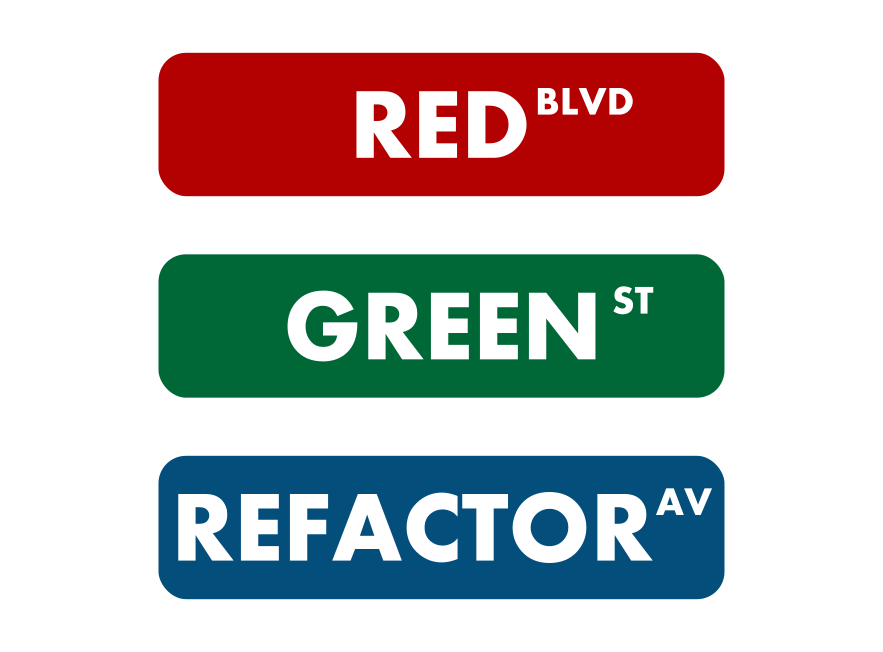

Hi. Manuel from France here.

:warning: :construction: About this GitHub: The reason I've set up this GitHub account is just for showcasing some of my work to potential employers ;) And, even though I plan to open source some of these works eventually, please don't use these sources as they currently stand, since they're still just a bit more than "walking skeletons" :stuck_out_tongue:

## :checkered_flag: Stacks I've enjoyed so far

#### Back

  

#### Front

   

## 🔭 Technologies I'm currently interested in
For personal projects and when I've got the choice of the tools, I am currently interested in:
* for apps with UI on desktops:

 with 
* and I plan to look into the space of developing Android apps too.

Why Java ?
* "Sustainable design" / "Green IT" => I hope to gradually reduce the "ecological footprint" of my apps
* I am still trying to understand if the choice of programming language (and its related best practices, like its frameworks, functional VS OO etc...) makes a difference at all in the final quantity of CO2 and hardware resources needed. Intuitively I have been thinking that it does, but maybe it is counterintuitive.
* anyway. I've been working professionally with Java, and I enjoy its readability and solidity. My quest for the "perfect eco friendly language" has been broad, but in the end I came back to Java, as it seems resources friendly enough to me :p

## :computer: Misc technological interests

* TDD => 

(image from [freesvg.org](https://freesvg.org))

* Writing background batches / stored SQL procedures can be a nice experience too, sometimes :D

##  :hearts: Other interests
* mindfulness meditation / trying to practice mindfulness
* video games (RPG, Turn based strategy...)
* quite a bit of Slay The Spire...
